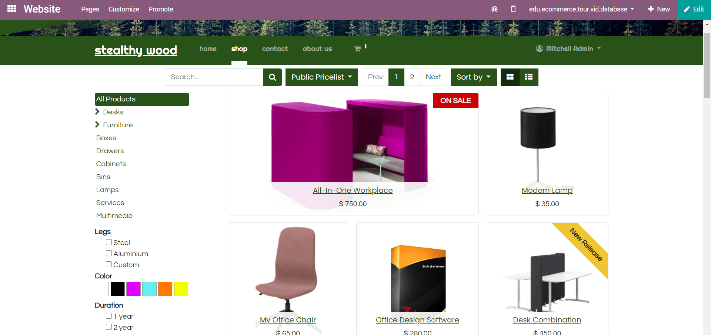
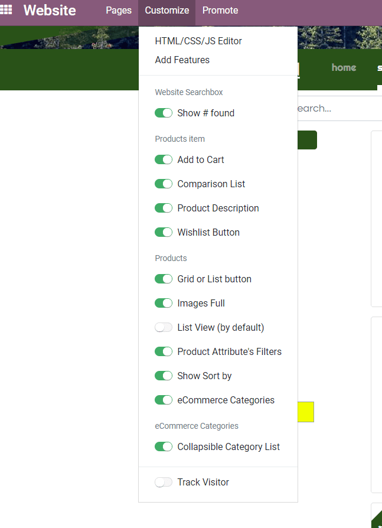

==================================
How To Customize Your Catalog Page 
==================================

Product Catalog
===============

All your published items show up in your catalog page (or *Shop* page).

Most options are available in the *Customize* menu: display attributes,
website categories, etc.

Highlight A Product
===================

Boost the visibility of your star/promoted products: push them to top, make them
bigger, add an editable ribbon to attract attention (Sale, New, etc.). Open the Shop page, switch
to Edit mode, and click any item to start customizing.

See how to do it: https://www.odoo.com/openerp_website/static/src/video/e-commerce/editing.mp4

Quick Add To Cart
=================

If your customers tend to buy a lot of items at once, make their process shorter by enabling 
purchases from the catalog page. To do so, add a product description, and an add to cart button. 
Turn on the following options in the *Customize* menu:  Product Description, Add to Cart, and 
List View (to display the product description better).

.. image:: ./media/shop_list.png
   :align: center