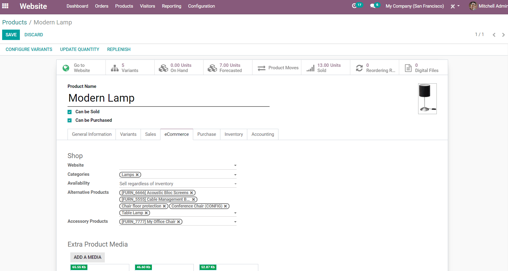
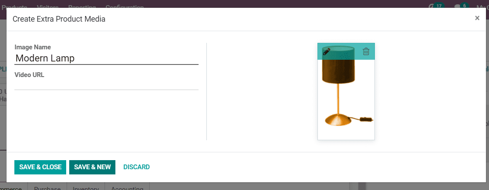
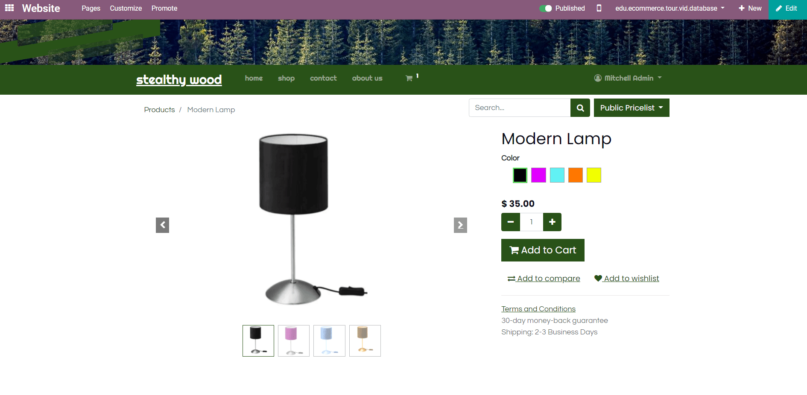

=========================================
How To Display Several Images Per Product
=========================================

By default, your product page only displays the main image of your product.
If you'd like to show multiple images of your product, you can turn the image into a carousel.

.. image:: ./media/multi_images01.png
   :align: center

* Open a product template form and click the *eCommerce* tab. Then click *Add A Media* in 
  the *Extra Product Media* section.

   
* A pop-up will appear, in which you can add a title and upload additional media.

* Any additional media will be displayed the default product photo on the product page.

.. note:: 
    Additional images are commonly used on products with a number of variants.
