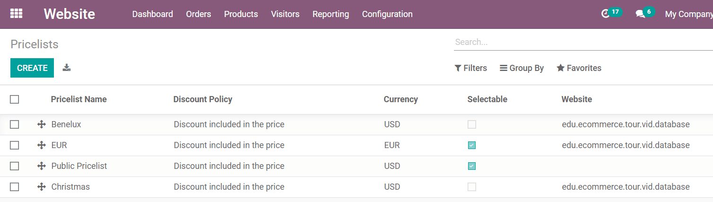

==============================================
How To Adapt The Prices To My Website Visitors
==============================================

This section sheds light on pricing features found in the eCommerce app:

* force a price by geo-localization,

* let the customer choose the currency.

As a pre-requisite, check out how to managing product pricing:
:doc:`../../sales/products_prices/prices/pricing`).

Geo-IP Automatically Applies The Right Price
============================================

Assign country groups to your pricelists. That way, visitors who aren't
logged in yet will get their own currency when landing on your website.

Once logged in, they get the pricelist matching their country.

Currency Selector
=================

In the case that you sell in several currencies, you can let your customers choose
their own. Check the *Selectable* box to add the pricelist to the website drop-down menu, which
can be found in *Pricelists* under the *Products* menu, located in the Website application.

.. seealso::

  * :doc:`../../sales/products_prices/prices/pricing`
  * :doc:`../../sales/products_prices/prices/currencies`
  * :doc:`promo_code`
