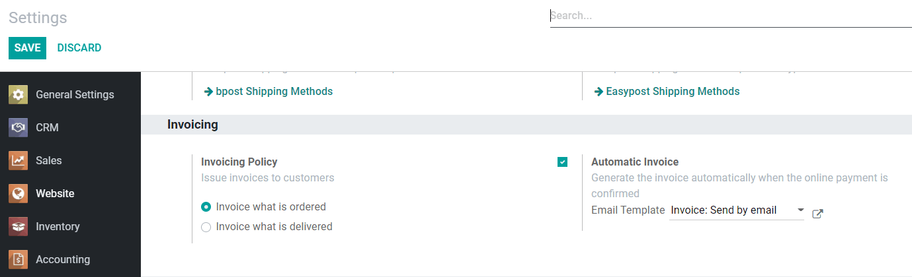

================================================
How To Manage Orders Paid With Payment Acquirers
================================================

Odoo automatically confirms orders as soon as the payment is authorized 
by a payment acquirer. This triggers the delivery.
If you invoice based on ordered quantities,
you are also requested to invoice the order.

What Are The Different Payment Statuses
=======================================
At anytime, the user can check the transaction status from the order, by selecting
*Payment Transactions* under the *Configuration* menu.

* *Draft*: transaction under processing.

* *Pending*: the payment acquirer keeps the transaction on hold, and you 
  need to authorize it from the acquirer interface.

* *Authorized*: the payment has been authorized, but not yet captured.
  In Odoo, the order is already confirmed. Once the delivery is done, you
  can capture the amount from the acquirer interface (or from Odoo, if you use
  Authorize.net).

* *Done*: the payment is authorized and captured. The order has been confirmed.

* *Canceled*: when the customer cancels the payment in the payment acquirer form.
  They are taken back to Odoo, in order to modify the order.

* *Error*: an error has occured during the transaction. 
  The customer needs to retry the payment.
  The order is still in draft.

.. note:: Specific messages are provided to your customers for every
   payment status whenever they are redirected to Odoo after the transaction.
   To edit these messages, go to the *Messages* tab of the payment
   method.

Automatically Generate Invoices At Order
========================================

When the order is confirmed, you can also have an invoice automatically issued
and paid. This fully-automated feature is designed for businesses that invoice 
orders straight on.

To do this, go to the *Invoicing* section of the *Settings* in the Website application,
and select *Invoice What Is Ordered* and then select *Automatic Invoices*, which will
generate an invoice automatically when the online payment is confirmed.

.. note::
   If you choose this mode, you are requested to select a payment journal, in order to record 
   payments in your books. This payment is automatically reconcilied with the invoice, marking it as 
   paid. Select your **bank account** if you get paid immediately on your bank account. If you don't 
   you can create a specific journal for the payment acquirer (type = Bank). That way, you can track
   online payments in an intermediary account of your books until you get paid into your bank
   account (see :doc:`../../general/payment_acquirers/payment_acquirers`).

Capture The Payment After The Delivery
======================================
With this mode (which is only available with Authorize.net), the order is confirmed, 
but the amount is kept on hold. Once the delivery processed, you can capture the payment from Odoo.

.. image:: media/capture-manually.png
    :align: center

To capture the payment, open the transaction from the order in *Payment Transactions*.
Then, click *Capture Transaction*.

With other payment acquirers, you can manage the capture in
their own interfaces, not from Odoo.